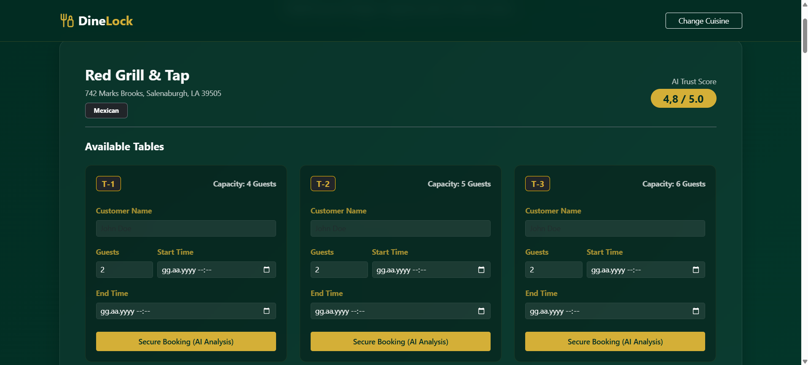
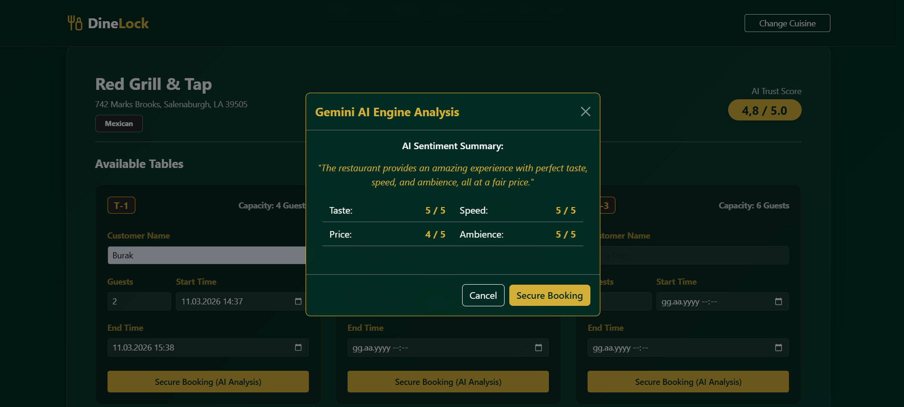

# DineLock: High-Concurrency Restaurant Reservation System


DineLock is an enterprise-grade backend application designed to solve complex concurrency challenges in the hospitality sector. While standard booking systems often fail under heavy concurrent load, DineLock guarantees data integrity by preventing race conditions during simultaneous booking attempts.

Additionally, the system integrates a generative AI engine to perform asynchronous multi-criteria sentiment analysis on restaurant reviews, providing users with a calculated "Trust Score."

## 🏗️ Architectural Highlights & Engineering Solutions

### 1. Concurrency Management (Pessimistic Locking)
The core challenge of any booking system is the "Double-Booking" problem. If two users attempt to reserve the same table at the exact same millisecond, standard isolation levels fall short.
* **Solution:** Implemented **Pessimistic Write Locks** at the database level via Spring Data JPA. When a transaction accesses a specific table record, it locks the row until the commit is finalized. Simultaneous requests are securely blocked and handled via custom `ReservationConflictException` routing, ensuring 0% collision rates without throwing raw server errors to the client.

### 2. Asynchronous AI Integration & Data Consistency
The system utilizes the Google Gemini API (v2.5 Flash) to evaluate restaurant reviews based on Taste, Speed, Price, and Ambience.
* **Performance:** To prevent I/O blocking and UI freezing, the AI analysis is fetched entirely asynchronously via AJAX after the user interacts with the UI.
* **Data Consistency:** LLMs are non-deterministic. To prevent discrepancies between the UI's pre-rendered Trust Score and the AI's live calculation, the database is seeded using **Deterministic Data Profiles** (Prompt Engineering). This ensures the AI parses exact, predictable sentiments, guaranteeing absolute mathematical consistency across the application.
* **Fault Tolerance:** Engineered with robust fallback mechanisms. If the AI API experiences high demand or network timeouts, the system gracefully handles the HTTP errors without crashing the main reservation workflow.

### 3. Performance Optimization (Caching Layer)
Heavy database queries, such as filtering top-rated restaurants by cuisine, are expensive.
* **Solution:** Integrated Spring Cache. Read-heavy, infrequently changing queries are intercepted and served directly from RAM memory, significantly reducing database I/O overhead and improving response times.

### 4. CI/CD & Industry Workflows
* **Continuous Integration:** Automated build pipelines configured via GitHub Actions. Every push to the `master` branch triggers a clean Maven build in an isolated Ubuntu environment.
* **Workflow:** The codebase was developed utilizing GitHub Copilot, mirroring industry-standard pair-programming practices to ensure optimal code quality and modern architectural patterns.

## 💻 Tech Stack

* **Backend:** Java 21, Spring Boot 4.1.x, Spring WebMVC
* **Data Access & DB:** Spring Data JPA, Hibernate, MySQL 8.0
* **Frontend:** Thymeleaf, Bootstrap 5, Glassmorphism UI
* **AI Engine:** Google Generative AI (Gemini 2.5 Flash)
* **Infrastructure:** Docker, Docker Compose, GitHub Actions

## 🚀 Getting Started (Docker Installation)

The entire application and its database are fully containerized. You do not need Java or MySQL installed on your local machine to run DineLock.

### Prerequisites
* Docker & Docker Desktop installed.
* A valid Google Gemini API Key.

### 1. Setup Environment Variables
Create a `.env` file in the root directory of the project and insert your API key:
```env
GEMINI_API_KEY=your_google_gemini_api_key_here
```

### 2. Build and Run the Containers

Open your terminal in the project root and execute the following command:

```bash
docker-compose up --build -d
```

Docker will pull the MySQL 8.0 image, build the Spring Boot application image via the Dockerfile, and map the required ports.

### 3. Access the Application

Once the containers are running, open your browser and navigate to:

```text
http://localhost:8080
```

> **Note:** The database is configured to generate deterministic seed data upon its first initialization.

## 🔒 Error Handling Demo

To test the Pessimistic Lock mechanism:

1. Open the application in two separate incognito browser windows.
2. Attempt to book the exact same table for the exact same time simultaneously.
3. Observe how the system securely processes one transaction while routing the other to a controlled **"Reservation Conflict"** UI warning, rather than a `500 Internal Server Error`.

## 📸 Screenshots


*The landing page features an elegant Glassmorphism UI design, allowing users to explore top-rated restaurants filtered by their preferred cuisine.*


*The interactive dashboard displays available tables for each restaurant alongside its corresponding capacity, current reservation details, and pre-calculated AI Trust Score.*


*Clicking the booking button triggers an asynchronous AJAX call to the Gemini AI Engine, parsing sentiment scores on the fly while displaying a clean modal loading state.*


*Demonstration of the system's lock mechanism processing one booking successfully while immediately routing the conflicting simultaneous transaction to a controlled warning banner.*